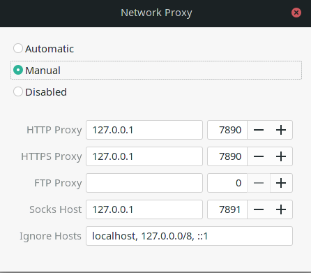

## what I do

### 0. sudo

~~~
sudo vim /etc/sudoers.d/twang
### add 
### twang ALL=(ALL) NOPASSWD:ALL
### or append to the file /etc/sudoers
~~~

### 0. gnome extension

~~~
desktop icon ng
Caffeine
Dash to Dock
pop shell
~~~

### 0. mirror

~~~
sudo pacman-mirrors -i -c China -m rank
~~~

### 1. browser

~~~
yay -S google-chrome
sudo pacman -R firefox firefox-gnome-theme-maia
~~~

### 2. ifconfig (no necessary)

> [ref](https://wiki.archlinux.org/index.php/Network_configuration#iproute2)
>
> Arch Linux has deprecated [net-tools](https://archlinux.org/packages/?name=net-tools) in favor of [iproute2](https://archlinux.org/packages/?name=iproute2)
>
> |                 Deprecated command                 |                     Replacement commands                     |
> | :------------------------------------------------: | :----------------------------------------------------------: |
> |                        arp                         |                         ip neighbor                          |
> | [ifconfig](https://en.wikipedia.org/wiki/ifconfig) |                     ip address, ip link                      |
> |                      netstat                       | [ss](https://wiki.archlinux.org/index.php/Network_configuration#Investigate_sockets) |
> |                       route                        |                           ip route                           |

~~~
sudo pacman -S net-tools
~~~

### 3. zero-tier one

~~~
sudo pacman -S zerotier-one
sudo zerotier-one -d   ###It is important
sudo zerotier-cli join e5cd7a9e1c700789
sudo systemctl list-unit-files --type=service | grep zerotier
sudo systemctl enable zerotier-one.service
~~~

~~~
ssh tw@10.242.36.193  ##test
ssh-keygen 
ssh-copy-id tw@10.242.36.193
scp tw@10.242.36.193:.ssh/config .ssh/    ##need some change
scp tw@10.242.36.193:.gitconfig .
~~~

### 4. clash

~~~shell
sudo pacman -S clash
cd .config/clash
mv config.yaml config.yaml.bkup
wget -O config.yaml https://s.trojanflare.com/clashx/80251f48-b43e-43d0-ba90-e681366a6023
mv Country.mmdb Country.mmdb.bkup
scp tw@10.242.36.193:.config/clash/Country.mmdb .
#### http://clash.razord.top/

sudo systemctl list-unit-files --type=service | grep clash
sudo systemctl start clash@twang.service
sudo systemctl enable clash@twang.service
~~~

now we cannot use google, we should set proxy

~~~
setting -> network -> network proxy
~~~



or we can do it in terminal if our command need proxy

~~~
## add this in the .zshrc
# 启动代理
proxy () {
  export https_proxy=http://127.0.0.1:7890 http_proxy=http://127.0.0.1:7890 all_proxy=socks5://127.0.0.1:7891
  echo "HTTP Proxy on"
}

# 关闭代理
noproxy () {
  unset http_proxy
  unset https_proxy
  unset all_proxy
  echo "HTTP Proxy off"
}
~~~

```
proxy
noproxy
```

then config the swithomega, just copy the bakeup link. The we can turn off the proxy and use google.

### 5. .dotfiles

~~~
yay -S tmux
## vim zsh default has
~~~

~~~
git clone https://github.com/spartazhc/dotfiles.git .dotfiles
cd .dotfiles
git clone https://github.com/anishathalye/dotbot.git dotbot
./install
./install_plugins.sh

### restart zsh, need adding some plugins, now we should open the proxy because git sometimes do not work.

sudo pacman -S xcape
systemctl --user start xcape
systemctl --user enable xcape
systmectl --user restart xcape
### no sudo
### xcape service doesnot exist. 
~~~

### 6. some software(if need)

~~~
> yay -S gvim # to use clipboard("+y "+p)
> vim --version | grep "clipboard"
+clipboard         +jumplist          +popupwin          +user_commands
+ex_extra          -mouse_jsbterm     -sun_workshop      +xterm_clipboard
~~~

~~~
yay -S visual-studio-code-bin

yay -S wps-office-cn
yay -S ttf-wps-fonts
yay -S wps-office-mui-zh-cn

yay -S typora
yay -S nutstore
yay -S mathpix-snipping-tool
yay -S htop ## top enhancement
ncdu  ## disk management
timeshift  ## backup tool
neofetch  ## show system message
~~~

### 7. fcitx

~~~
sudo pacman -S fcitx-im fcitx-configtool fcitx-cloudpinyin
sudo vim .xprofile
### add
### export GTK_IM_MODULE=fcitx
### export QT_IM_MODULE=fcitx
### export XMODIFIERS="@im=fcitx"
### need to restart
~~~

### 8. SJTU vpn

~~~
yay -S strongswan
yay -S networkmanager-strongswan

### setting -> networks -> vpn -> add vpn -> IKEv2 -> ip user passwd and select request an inner IP address
~~~

### 9.python virtualenv

to avoid anaconda

~~~
sudo pip install virtualenv
sudo pip install virtualenvwrapper
# sudo is important
~~~

进入 用户主目录，打开 *.zshrc* or *.zsh_local_after* 文件，添加如下代码：

```bash
#export WORKON_HOME=$HOME/.virtualenvs
#export PROJECT_HOME=$HOME/Devel
#source /usr/local/bin/virtualenvwrapper.sh

export WORKON_HOME='~/.virtualenvs'
export VIRTUALENVWRAPPER_PYTHON="/usr/bin/python3" 
source /usr/bin/virtualenvwrapper.sh
```

~~~
$ source .zshrc
~~~

- **workon**                                    列出虚拟环境列表
- **lsvirtualenv**        详细的列出我们创建的虚拟环境
- **mkvirtualenv [虚拟环境名称]**        新建虚拟环境
- **workon [虚拟环境名称]**            切换虚拟环境
- **rmvirtualenv [虚拟环境名称]**    删除虚拟环境
- **deactivate**                               离开虚拟环境
- **showvirtualenv  [虚拟环境名称]**

### 10. flameshot

~~~
yay -S flameshot
~~~

>  setting -> keyboard -> add new

>  command = flameshot gui

>  shortcut = Ctrl Alt A