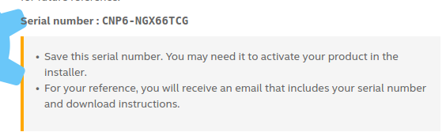
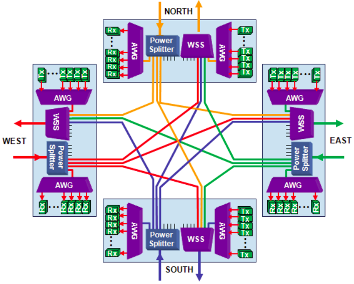

**0.command**

**[R]**录下的所有子目录和文件

**chmod** 777 filename

user/group/others/all     (+ - =)

**chmod** u=rwx go=rw filename

**chmod** a+w filename

have x can cd to this dir

**link file** similar to the 快捷方式 in windows

可否执行不看后缀，看x

mkdir -m 711 dirname

**ls -ld test***  all begin with test

mkdir -p test1/test2/.....  many dir

rmdir  remove empty dir

**rm**    **-r**(递归删除) is very dangerous

**cat** **-n** filename  列出行号(空白也会有行号  -b空白没有行号)

**head -n 30** filename   前三十行

**head -n -30** filename   没有后三十行

**vim** crtl+v ->visual block  列操作

**alias** lm = 'ls -al'   设置命令别名

work="/./././"

cd $work


我们首先需要更新下资源。

**sudo  apt-get  update**  

对系统中的软件都更新升级。

**sudo  apt-get   upgrade**  

更新升级某个软件，例如这里更新gimp。

**sudo  apt-get   upgrade   gimp**

**1.new here**

set  your new **password**

```
sudo passwd
```

**root和twang**

su->输入密码

crtl+D 或exit 退出root

**2.快捷切换输入法？**

装一个搜狗输入法

Fcitx配置->只保留**搜狗输入法**和**键盘（英语）-美国**（谁在上边谁是默认） 就可以 **shift** 快速切换输入法

**3.typora上方工具栏？**

最最上边！！！真好

**4.截图**

系统设置->键盘->快捷键->截图

[参考链接](https://blog.csdn.net/u013162035/article/details/78976301)

**5.QQ**


**6.快捷键**

[链接](<https://blog.csdn.net/lujianfeiccie2009/article/details/7521347>)

**7.浏览器快捷键**

```
下一个标签页： Ctrl+Tab 或  Ctrl+PageDown
前一个标签页： Ctrl+Shift+Tab 或  Ctrl+PageUp
新建标签页： Ctrl+T
新建窗口： Ctrl+N
移动标签到开头（上下）： Ctrl+Home  或 home
移动标签到结尾（上下）： Ctrl+End  或 end
关闭标签： Ctrl+W 
关闭窗口： Ctrl+Shift+W 或  Alt+F4 或 F4
```

**8.zotero**

[链接](https://www.jianshu.com/p/9f388b34eb09)

**9.anaconda**

<https://blog.csdn.net/ITBigGod/article/details/85690257>

<https://www.cnblogs.com/gaofighting/p/8799169.html>

下边这个主要是没有添加环境变量，要自己添加（找好自己的路径）：

~~~
# export PATH="/opt/anaconda/bin:$PATH"  # commented out by conda initialize

# >>> conda initialize >>>
# !! Contents within this block are managed by 'conda init' !!
__conda_setup="$('/opt/anaconda/bin/conda' 'shell.zsh' 'hook' 2> /dev/null)"
if [ $? -eq 0 ]; then
    eval "$__conda_setup"
else
    if [ -f "/opt/anaconda/etc/profile.d/conda.sh" ]; then
        . "/opt/anaconda/etc/profile.d/conda.sh"
    else
        export PATH="/opt/anaconda/bin:$PATH"
    fi
fi
unset __conda_setup
# <<< conda initialize <<<
~~~


```shell
# 将anaconda的bin目录加入PATH，根据版本不同，也可能是~/anaconda3/bin
echo 'export PATH="~/anaconda3/bin:$PATH"' >> ~/.bashrc
# 更新bashrc以立即生效
source ~/.bashrc
```

```shell
rm -rf ~/anaconda3
```

常用命令：

<https://blog.csdn.net/m0_37201243/article/details/83689324>


获取版本号：

```bash
conda --version
```

或：

```bash
conda -V
```

列举当前所有工作环境

```bash
conda info --envs
conda env list
```

激活某个环境和退出某个环境

```bash
conda activate your_env_name
conda deactivate
```

删除已有环境

```bash
conda remove --name your_env_name --all
```

创建工作环境

```bash
conda create --name your_env_name python=x.x
```

**各种清华源**

<https://blog.csdn.net/weixin_38056657/article/details/81186215?utm_source=blogxgwz0>

conda源在国内只有清华镜像有 ，修改源只需如下命令：
```bash
conda config --add channels https://mirrors.tuna.tsinghua.edu.cn/anaconda/pkgs/free/
conda config --set show_channel_urls yes
```

**使用google colab运行RNN网络代码报告错误"ValueError: Object arrays cannot be loaded when allow_pickle=False"**

<https://blog.csdn.net/scrence/article/details/89645854>

```
pip install numpy==1.16.2
```



```python
im = sic.imread(name, mode="RGB").astype(np.float32)
AttributeError: 'module' object has no attribute 'imread'
```

需要安装pillow

官方scipy中提到，[`imread`](https://docs.scipy.org/doc/scipy/reference/generated/scipy.misc.imread.html#scipy.misc.imread) is deprecated! [`imread`](https://docs.scipy.org/doc/scipy/reference/generated/scipy.misc.imread.html#scipy.misc.imread) is deprecated in SciPy 1.0.0, and will be removed in 1.2.0. Use `imageio.imread` instead.

SciPy1.0.0不赞成使用imread，在1.2中已经弃用，可以使用imageio.imread来代替


