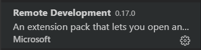
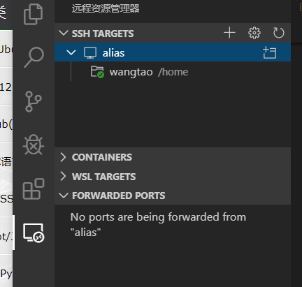
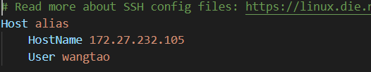
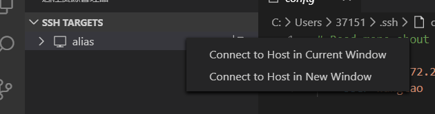
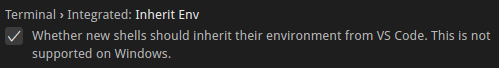

#### vscode ssh

#### 1.下载插件



#### 2.相应设置

 Remote-SSH:Settings，设置Remote.SSH:Show Login Terminal为true 

#### 3.连接



点击齿轮


选第一个



修改hostname 和 user 并保存



右键连接。

输入密码登录

打开新的终端 就是 bash

左侧可以查看服务器目录

可以下载文件


### 11.15

ssh的插件似乎要都装上才好用、？

```
scp /home/space/music/1.mp3 root@www.runoob.com:/home/root/others/music 
scp /home/space/music/1.mp3 root@www.runoob.com:/home/root/others/music/001.mp3 
```

免密登录，要在本地生成 id_rsa.pub， 然后上传到服务器上，或者把其中内容复制，粘贴到服务器的

这一步如果不用命令ssh-copy-id，可以手工操作，直接把客户端公钥文件(/.ssh/id_rsa.pub)内容拷贝到远程server端的/.ssh/authorized_keys文件里面即可。


### 2020.12.9

这次主要是两个问题，第一，vscode新建terminal无效，什么都没有，也无法输入。第二，服务器只有bash，本地用的是zsh。

解决方法：

要了解配置的区别，配置对应着json文件


对于User，路径为 /home/tw/.config/Code/User/settings.json

对于 Remote，路径为 /home/wangtao/.vscode-server/data/Machine/settings.json

对于 Workspace，路径为 当前工作路径/.vscode/setting.json

这几个文件，第一个是根本的，也是通用的，后边的都会受到第一个的影响，后边的可以理解为一些个性化的具体设置，类似于.bashrc

好了，对于新建terminal无效，如下操作：



勾选即可，后续会有弹窗，记得选No

另外，不要修改user的配置文件，

​    "terminal.integrated.shell.linux": "",

​    "terminal.integrated.automationShell.linux": "",

​    // "terminal.integrated.automationShell.linux": "",

​    // "terminal.integrated.automationShell.osx": ""

上边什么都不要填，不然如果user的配置文件你写了/bin/zsh，你会发现到服务器上他也会优先去找这个，然后找不到。